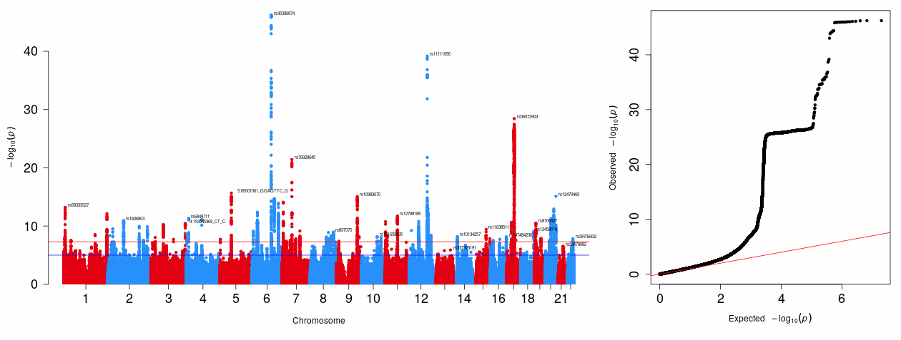

***


<br>
<br>

Here we present code to calculate Genome-Wide-Association Study (GWAS) Summary Statistics for Neurocognitive Disorder (NCD).
Please see our Git repository for more information [here](https://github.com/DEMON-NEUROHACK/Challenge-1-London-Team-B-Genome-Wide-Association-Lovers-).

We suggest a novel way of defining NCD as a continuous phenotype, and we employ a mixed linear model to account for pronounced population stratification in the South Asian sample, which is more diverse than European samples, for example.
We decided to also run simultaneous binary GWASs for modifiable dementia risk factors that have a higher prevalence in South Asians compared to Europeans (e.g., type 2 diabetes, hypertension, chronic heart disease, stroke).

The analyses presented below were run on DNAnexus in JupylerLab.


  - Note to NEUROHACK facilitators: This code is written for use with the full dataset for LASI-DAD to run it in the full LASI-DAD data.
  - Please run this in one continuous JupyterLab environment, or use `dx upload` to save created files.
  - Please adjust the directories and file names according to the full unrelated dataset (N = 932).


<br>
<br>

# Phenotypic Data cleaning
The phenotype file needs to include the following in its header:

  - FID - family identifier (in this case since the participants are unrelated we set the FID to 0 for all rows so that Regenie accepts the file as input)
  - IID - the individual identifier number (i.e. subjectID in the provided LASI-DAD folder)
  - Phenotypes (can have multiple columns for separate phenotypes that you want to run simultaneous GWAS on) - we are using Neurocognitive Disorder (ncd); high blood pressure (hypertension); type 2 diabetes (T2DM); coronary heart disease (CHD); stroke
  - Because NCD is a continuous phenotype (0,1,2) it is included in the continuous pheno tsv, then we produce a separate folder with all the remaining binary phenotypes. This is because Regenie will need to be run separately to account for doing linear versus logistic regression.
  - Ideally, we would like to have more levels in the NCD phenotype defined by parental history of dementia, which might enable a more nuanced definition. However, there are currently not enough individuals with this data present in LASI DAD to make this possible.


```{bash pheno, eval=F}

## download files
dx download "LASI_DAD_Neurohack_Phenotype_full.csv"
dx download "LASI_DAD_Neurohack_health_pheno_full.csv"

```


```{r pheno_cleaning, eval=F}
library(dplyr)
library(data.table)

# load provided LASI-DAD files
pheno_main <- fread("LASI_DAD_Neurohack_Phenotype_full.csv")
pheno_main$FID = 0
pheno_comorbid <- fread("LASI_DAD_Neurohack_health_pheno_full.csv")
head(pheno_main)
head(pheno_comorbid)

full_pheno <- merge(pheno_main, pheno_comorbid, by = "subjectID")
head(full_pheno)


pheno_regenie <- full_pheno %>% select(FID, subjectID, ncd, r1hibpe, r1diabe, r1hearte, r1stroke) %>% rename(IID = "subjectID") %>% rename(hypertension = "r1hibpe") %>% rename(T2DM = "r1diabe") %>% rename(CHD = "r1hearte") %>% rename(stroke = "r1stroke")
head(pheno_regenie)

# file with continuous phenotypes

pheno_cont <- pheno_regenie %>% select(FID, IID, ncd)
head(pheno_cont)

# file with binary phenotypes

pheno_bin <- pheno_regenie %>% select(FID, IID, hypertension, T2DM, CHD, stroke)
head(pheno_bin)

write.table(pheno_regenie, file = "phenotype_regenie.tsv", col.names = T, sep = "\t", na = "NA", row.names = F, quote = F)
write.table(pheno_cont, file = "continuous_phenotype_regenie.tsv", col.names = T, sep = "\t", na = "NA", row.names = F, quote = F)
write.table(pheno_bin, file = "binary_phenotypes_regenie.tsv", col.names = T, sep = "\t", na = "NA", row.names = F, quote = F)

```

<br>
<br>

# Covariate Data cleaning

Header: FID, IID, education, sex, genetic PCs

Education was included because over 50% of the sample are illiterate, which could confound the results for the NCD diagnosis.
Ideally the covariate list would also include genotyping batch, but we did not

```{bash covariate, eval=F}

## download files
dx download "LASI_DAD_Neurohack_Phenotype_full.csv"
dx download "LASI_DAD_Neurohack_genetic_PCs_unrelated_932.csv"

```


```{R, eval=F}
## load packages
packages <- c("dplyr", "readr")
## check if install
new_pkg <- packages[!(packages %in% installed.packages())]
## install missing pkgs
install.packages(new_pkg)
## load
lapply(packages, require, character.only = TRUE)

## read in source files
ptype <- read.csv("LASI_DAD_Neurohack_Phenotype_full.csv")
pcs <- read.csv("LASI_DAD_Neurohack_genetic_PCs_unrelated_932.csv")

## ensure order of rows is the same
ptype <- dplyr::arrange(ptype, subjectID)
pcs <- dplyr::arrange(pcs, subjectID)
head(ptype, 10)
head(pcs, 10)

## convert cols to numeric
ptype$ragender <- as.numeric(substr(ptype$ragender, 1, 1))
ptype$raeducl <- as.numeric(substr(ptype$raeducl, 1, 1))


covariate_df <- data.frame("FID" = ptype$subjectID, "IID" = pcs$subjectID,
                           "age" = ptype$r1agey, "sex" = ptype$ragender,
                          "education" = ptype$raeducl, "genetic_pc1" = pcs$EV1,
                          "genetic_pc2" = pcs$EV2, "genetic_pc3" = pcs$EV3,
                          "genetic_pc4" = pcs$EV4, "genetic_pc5" = pcs$EV5,
                          "genetic_pc6" = pcs$EV6, "genetic_pc7" = pcs$EV7,
                          "genetic_pc8" = pcs$EV8, "genetic_pc9" = pcs$EV9,
                          "genetic_pc10" = pcs$EV10)
head(covariate_df)
cov_df_fid0 <- covariate_df
cov_df_fid0$FID <- 0


## save files
write_tsv(covariate_df, "covariates.tsv")
write_tsv(cov_df_fid0, "covariates_fid0.tsv")

```


<br>
<br>


# Genetic Data cleaning


```{bash, eval=F}
#### transform to plink on JupyterLab
## 12/01/2021
## Anna Furtjes


conda install -c bioconda plink2

# download vcf files
dx cd
dx download "Genotype data/Test data/*dose.vcf.gz" -r

# download script to fix vcf formatting
dx download file-G7Q5K1808Y84P92v82b5k231

# unzip vcf files
gunzip *.dose.vcf.gz

# fix column formatting
Rscript fix_vcf_formatting.R

#clean up
rm chr*

# run PLINK to get bed, fam and bim files
plink2 --vcf fixed_allchr.dose.vcf --make-bed --chr 1-22 --no-fid --out all_chromosomes


# upload files
dx upload all_chromosomes*


```

This code refers back to this Rscript: `fix_vcf_formatting.R`
```{r, eval=F}
install.packages("data.table")

library(data.table)

output<-NULL

#setwd('/home/dnanexus/unzipped')

for(i in 1:22){

    print(paste0("Formatting chr. no. ", i))

    table<-fread(paste0("chr",i,".dose.vcf"),header=F)
    #head(table)
    names(table) <- append(c("#CHROM","POS","ID","REF","ALT","QUAL","FILTER","INFO","FORMAT"),paste0("L",1:(ncol(table)-9)))

    output<-rbind(output, table)
    print(paste0("Formatted ",i," chromosome(s)"))
}

fwrite(output,file="fixed_allchr.dose.vcf", sep="\t",quote=F, col.names=T,row.names=F)

print("Done formatting all chromosomes")
```


<br>
<br>


# SNP list creation

In the SNP list we include references to SNPs that are included for the different steps in Regenie.

  - Step 1 calculated the genetic relatedness matrix based on genotyped SNPs only ("genotyped" & "Typed_only" SNPs in dataset).
  - Step 2 takes into account imputed and genotyped SNP in the reference panel from imputation ("genotyped" & "imputed").
  - Genotyped SNPs have been filtered for an INFO metric of 0.4 to include SNPs of high quality imputation. This cut-off matched the binary case-control GWAS in LASI DAD to enable more reliable comparison with our continuous phenotype GWAS.

The file path to the full Info Files will be different in the full dataset.

```{bash, eval=F}
# extract SNPs that have been genotyped only from the info files

## start from home
dx cd

# download info files
dx download "Genotype data/Info files/" -r
cd Info\ files/

# unzip files
gunzip *.info.gz

mkdir step1
mkdir step2

# filter to SNPs for each genotype category
for chr in {1..22}; do
    awk '{ if( $8=="Genotyped" || $8=="Typed_Only" && $7>=0.4 ) print $1 }' chr${chr}.info | sed 1d > step1/chr${chr}_step1_exclude_imputed
    awk '{ if( $8=="Genotyped" || $8=="Imputed" && $7>=0.4 ) print $1 }' chr${chr}.info | sed 1d > step2/chr${chr}_step2_exclude_type_only
done

cd step1/
cat $(ls -t ) > ../step1_merged
cd ../step2
cat $(ls -t ) > ../step2_merged
cd ..


```


<br>
<br>


# Regenie software setup

This script is deposited on DNAnexus as install_regenie_from_source.sh (file-G7Q0JgQ08Y80q3gXKp881P4f)
```{bash, eval=F}
## install regenie from source
echo "This should compile bgen and regenie from source"


## first install BGEN
# get it
wget http://code.enkre.net/bgen/tarball/release/bgen.tgz
tar zxvf bgen.tgz
mv bgen.tgz bgen
cd bgen
# compile it
./waf configure
./waf

# test it
#./build/test/unit/test_bgen
#./build/apps/bgenix -g example/example.16bits.bgen -list

## exit bgen dir
cd ..

## get regenie source code
wget https://github.com/rgcgithub/regenie/archive/refs/tags/v2.2.4.tar.gz
tar -xvzf v2.2.4.tar.gz
rm v2.2.4.tar.gz
cd regenie-2.2.4
## BGEN_PATH should be set to where bgen was downloaded to, for the jupyterlab on dnanexus this is:
## BGEN_PATH     = /opt/notebooks/bgen
## then make regenie
make BGEN_PATH=/opt/notebooks/bgen
## copy exe to bin
cp regenie /usr/local/bin/
## exit regenie dir
cd ..
```


<br>
<br>


# NCD GWAS

## Why do we use Regenie?
The LASI-DAD sample includes participants with more diverse ancestry than Europeans, for example. It would have been interesting to run GWAS for participants from South vs North Indian Ancestry, and to compare them, but we suggest the sample size was not big enough to produce robust results. Population stratification can inflate test statistics through false-positive genetic signal, especially in a small sample. Instead we decided to use a mixed linear model approach in which we use a genetic relatedness matrix to model genetic similarities between study participants. This has been shown to successfully account for population stratification [REF](https://www.nature.com/articles/s41588-021-00870-7).

Regenie fits polygenic effects in a linear mixed model using Ridge regression.
The pipeline is split into two steps:

  - First, blocks of directly genotyped SNPs are used to fit a cross-validated whole-genome regression model using Ridge regression, to determine the amount of phenotypic variance explained by genetic effects.
  - Second, the association between the phenotype and imputed (& genotyped) genetic variants is calculated conditional upon Ridge regression predictions from the first step. Proximal contamination is circumvented by using a leave-one-chromosome-out scheme.


Description taken from [REF](https://www.biorxiv.org/content/10.1101/2021.10.22.465437v2).

## Regenie step 1: Continuous pheno
We have a suspicion that the education covariate might have a third categorical level in the real data, which the code below would need to account for. If so, please adjust `--maxCatLevel 2` to `--maxCatLevel 3`.
```{bash, eval=F}
#### run regenie on JupyterLab
dx download file-G7Q0JgQ08Y80q3gXKp881P4f
bash install_regenie_from_source.sh

# download files prepared for regenie
#dx cd

#dx download "project-G7KBz1j08Y8PJk57Gfg1Jf3Z:/regenie_inputs/continuous_phenotype_regenie.tsv"

#dx download "regenie_inputs/covariates_fid0.tsv"


# load bed file
#dx download "regenie_inputs/all_chromosomes.bed" -r

# load fam file
#dx download "regenie_inputs/all_chromosomes.fam" -r

# load bim file
#dx download "regenie_inputs/all_chromosomes.bim" -r

# load SNP list of genotyped SNPs for this chromosome
#dx download "project-G7KBz1j08Y8PJk57Gfg1Jf3Z:/regenie_inputs/genotyped_snps/step1_genotyped_and_typed_only/step1_merged"


regenie \
    --step 1 \
    --force-step1 \
    --bed all_chromosomes \
    --extract step1_merged \
    --phenoFile continuous_phenotype_regenie.tsv \
    --keep all_chromosomes.fam \
    --covarFile covariates_fid0.tsv \
    --catCovarList sex,education \
    --maxCatLevels 2 \
    --bsize 50 \
    --lowmem \
    --lowmem-prefix tmp \
    --verbose \
    --out fit_out_cont


```


## Regenie step 2: Continuous pheno

```{bash, eval=F}
regenie \
    --step 2 \
    --bed all_chromosomes \
    --covarFile covariates_fid0.tsv \
    --phenoFile continuous_phenotype_regenie.tsv \
    --bsize 200 \
    --minINFO 0.4 \
    --minMAC 5 \
    --pred fit_out_cont.list \
    --out regenie_continuous_out

```


<br>
<br>


# Risk Factor GWASs
## Regenie step 1: Binary pheno
We have a suspicion that the education covariate might have a third categorical level in the real data, which the code below would need to account for. If so, please adjust `--maxCatLevel 2` to `--maxCatLevel 3`.

```{bash, eval=F}

regenie \
    --step 1 \
    --force-step1 \
    --bed all_chromosomes \
    --extract step1_merged \
    --phenoFile binary_phenotypes_regenie.tsv \
    --keep all_chromosomes.fam \
    --covarFile covariates_fid0.tsv \
    --catCovarList sex,education \
    --maxCatLevels 2 \
    --bsize 50 \
    --bt \
    --lowmem \
    --lowmem-prefix tmp \
    --verbose \
    --out fit_out_bin

```

## Regenie step 2: Binary pheno

```{bash, eval=F}
regenie \
    --step 2 \
    --bed all_chromosomes \
    --covarFile covariates_fid0.tsv \
    --phenoFile binary_phenotypes_regenie.tsv \
    --bsize 200 \
    --minINFO 0.4 \
    --minMAC 5 \
    --bt \
    --pred fit_out_cont.list \
    --out regenie_continuous_out

```


# Expected Output

<br>
<br>

We aim to visualise the genetic signal picked up by the GWAS in a Manhattan Plot and in a QQ plot. We will also assess metrics indicative of statistical inflation.




<br>
<br>


# Future directions

  - Explore the genetic overlap between our NCD GWAS and the risk factor GWAS we create in the code above. We plan to calculate linkage disequilibrium scores and weights within the LASI DAD data [REF](https://github.com/bulik/ldsc/wiki/LD-Score-Estimation-Tutorial) to model the shared genetics between NCD and risk factors using Genomic structural equation modeling [REF](https://github.com/GenomicSEM/GenomicSEM), and genomic Principal Component Analysis [REF](https://annafurtjes.github.io/genomicPCA/). We aim to identify major dimensions of variance in NCD that could be explained by shared genetics with risk factors.
  - Explore biological function of genome-wide significant SNPs
  - Test for genome-wide significant SNP that show up robustly between South and North Indian ancestry & across different ancestries (e.g., European ancestry [REF](https://www.nature.com/articles/s41588-021-00921-z), African ancestry [REF](https://jamanetwork.com/journals/jamaneurology/fullarticle/2771828), Japanese ancestry [REF](https://www.nature.com/articles/s41398-021-01272-3))
  - Explore and describe genetic variability (e.g. correlate an index of genetic heterogeneity with genetic PCs)
  - Compare heritability estimates between South and North Indians by splitting them into two groups, calculate genetic correlations between them. As we have access to individual level data, Genomic Complex Trait Analysis would allow us to estimate the proportion of phenotypic variance explained by genetic effects (through a genetic relatedness matrix), as well as the genetic overlap between two traits or populations.
